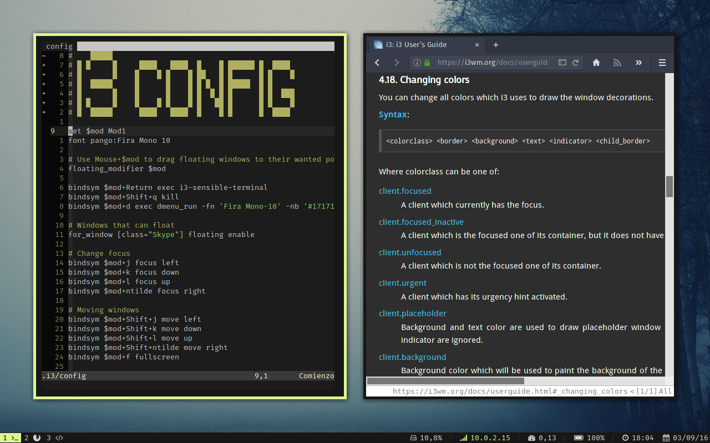

## About

My current dotfiles setup. I try to keep the configuration of the OS I use
in sync. This setup has been tested to work on Arch Linux, Ubuntu, OS X and
some MSYS/Windows applications.

## Install

Clone this repository in a location such as `~/.dotfiles`. Then, enter
the just cloned repository and start stowing the packages that you want.

    git clone git://github.com/danirod/dotfiles ~/.dotfiles
    cd ~/.dotfiles
    stow zsh
    stow openbox
    stow tmux

Note that `stow zsh` works because there is a directory named `zsh` at
`~/.dotfiles` and because the parent directory for `~/.dotfiles/` is
$HOME. If you are cloning this repository into a different location you will
need to change the target directory or you will get these dotfiles linked
at wrong locations.

## Packages

Most of the packages have the name of the application they are used by, such
as **atom**, **bash** or **zsh** and they don't need further explanation.
However, there are a few special packages:

* **osx**: special settings for MacOS X.
* **powershell**: special settings for Windows (PowerShell).
* **ubuntu**: special settings for Ubuntu based systems.
* **windows**: special settings for Windows (Cygwin / MSYS-NT).

## Disclaimer

**Please note that the settings provided by this repository are highly
opinionated and designed to fit my needs. I don't recommend anyone to stick
with my settings.** My suggestion on the use of this repository is to take
it as a framework for setting your own dotfiles.

**The contents of this repository are provided AS IS with no warranties.
I'm not responsible if you break your computer, lose your local settings or
do anything wrong because of running the wrong script or executing the wrong
command.**

